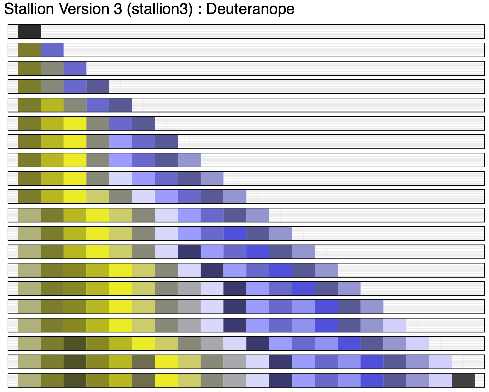

<p align="center"></a></p>
<hr>

[](https://www.tidyverse.org/lifecycle/#maturing)

## Installation

**Check Devtools**
``` r
if (!requireNamespace("devtools", quietly = TRUE)) install.packages("devtools")
```

**Install JGPlot2**
``` r
devtools::install_github("jeffmgranja/jgplot2")
```

## Example

### Main Palettes
**Discrete Palette (stallion3)**
``` r
displayAllColors(jgplot2:::.stallion3[[20]])
```
<p align="center"></a></p>
<hr>

**Continuous Palette (solarExtra)**
``` r
displayAllColors(colorRampPalette(jg_palettes()[["solarExtra"]])(10))
```
<p align="center"></a></p>
<hr>

**stallion3 normal vision**
``` r
lapply(seq_len(20), function(x){
	displayColors(jgplot2:::.stallion3[[x]]) +
		theme(plot.margin = unit(c(0, 0, 0, 0), "cm")) +
		coord_cartesian(xlim = c(1, 20))
}) %>% Reduce("+", .) %>% {. + plot_layout(ncol=1) +  plot_annotation(title = 'Stallion Version 3 (stallion3)')}
```
<p align="center"></a></p>
<hr>

**stallion3 deuteranope**
``` r
lapply(seq_len(20), function(x){
	displayColors(cvdSimulator(jgplot2:::.stallion3[[x]], "deuteranope")) +
		theme(plot.margin = unit(c(0, 0, 0, 0), "cm")) +
		coord_cartesian(xlim = c(1, 20))
}) %>% Reduce("+", .) %>% {. + plot_layout(ncol=1) +  plot_annotation(title = 'Stallion Version 3 (stallion3) : Deuteranope')}
```
<p align="center"></a></p>
<hr>

**stallion3 protanope**
``` r
lapply(seq_len(20), function(x){
	displayColors(cvdSimulator(jgplot2:::.stallion3[[x]], "protanope")) +
		theme(plot.margin = unit(c(0, 0, 0, 0), "cm")) +
		coord_cartesian(xlim = c(1, 20))
}) %>% Reduce("+", .) %>% {. + plot_layout(ncol=1) +  plot_annotation(title = 'Stallion Version 3 (stallion3) : Protanope')}
```
<p align="center"></a></p>
<hr>


